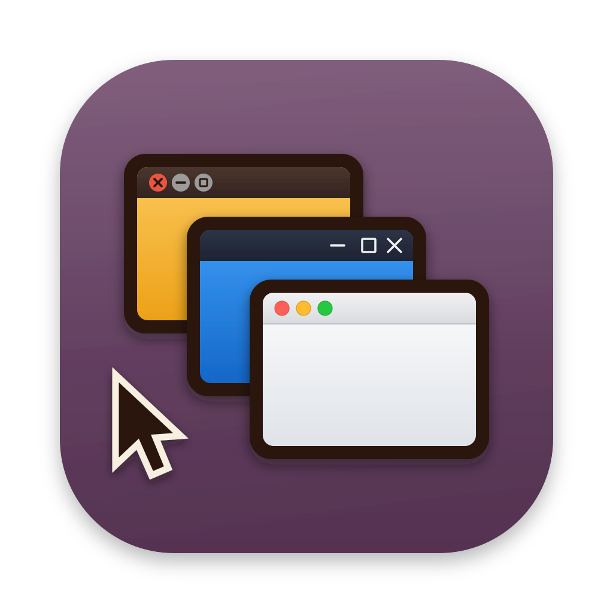

<p align="center">
  
</p>

# Desktop Logs Events And Protobuf Parser

**DLEAPP** parses artifacts left behind by **desktop applications** — the logs, events, and stored data of Electron/Chromium-based desktop apps: IndexedDB/LevelDB stores (including protobuf-encoded values), Local Storage, service-worker and HTTP caches, cookies, and application logs. It is a member of the LEAPP family, built on the RLEAPP framework.

DLEAPP is also meant to be a home for parsers that don't fit neatly into any of the other LEAPPs — a place for desktop-application and other odds-and-ends artifacts to live rather than being forced into iLEAPP, ALEAPP, RLEAPP, and the like.

### Supported applications

| Application | What is parsed |
| --- | --- |
| **Wire** (desktop) | Accounts, devices, conversations, messages, calls, attachments, cookies, service-worker cache, and media recovered by decrypting cached asset blobs. |
| **Discord** (desktop) | Messages, attachments and recovered media, servers, channels, users, searches, reactions, message drafts, client activity, channel navigation, gateway sessions, account and application details, and a full cache index. |
| **Signal** (desktop) | Messages, attachments decrypted from disk, conversations and groups, calls, reactions, protocol sessions and identity keys, and account details. Requires the database credential — see below. |

Discord Desktop keeps no message database of its own: the client renders from
REST API responses, and those responses stay in the Chromium HTTP cache. The
Discord artifacts read that cache directly, so messages, attachments and the
images themselves are recoverable after they were deleted server-side. The
approach follows Alex Caithness's work on treating a web app's browser
artifacts as an application in their own right
([browser-forensics-presentation-2025](https://github.com/cclgroupltd/browser-forensics-presentation-2025),
[mister-skinnylegs](https://github.com/cclgroupltd/mister-skinnylegs)).

The Chromium container formats these parsers rely on live in `scripts/chromium/`
(Simple Cache reader, Local Storage LevelDB reader) and are reusable by any
future Electron application parser. More desktop-application parsers will be
added over time.

### Signal Desktop needs a credential

Signal encrypts its message database with SQLCipher, and encrypts every file in
`attachments.noindex` with a key held inside that database. Recent versions wrap
the database key with the OS credential store, so it is **not** in the profile:

* macOS — login Keychain, service `Signal Safe Storage`
* Windows — Credential Manager

Capture it from the host and pass it in. DLEAPP accepts the credential, the
64 character database key itself, or a file holding either:

```
python3 dleapp.py -t fs -i <profile> -o <output> --signal-key
```

Given the flag with no value it prompts without echo, which keeps the secret out
of shell history and the process list. The GUI has an equivalent Signal key
field. A file named `signal_password.txt` beside the extraction is also picked
up, which suits batch runs. Older profiles that still hold a plaintext `key` in
`config.json` need nothing at all.

Without a credential the Signal artifacts report why and produce no rows, rather
than failing silently. `scripts/sqlcipher_decrypt.py` is the same pure-python
reader ALEAPP and iLEAPP use, so it needs no native SQLCipher build.

If you want to contribute hit me up on twitter: https://twitter.com/AlexisBrignoni   

## Requirements

**Python 3.9 or above** (older versions of 3.x will also work with the exception of one or two modules)

### Dependencies

Dependencies for your python environment are listed in `requirements.txt`. Install them using the below command. Ensure the `py` part is correct for your environment, eg `py`, `python`, or `python3`, etc. 

`py -m pip install -r requirements.txt`  
or  
 `pip3 install -r requirements.txt`

To run on **Linux**, you will also need to install `tkinter` separately like so:

`sudo apt-get install python3-tk`

To install dependencies offline Troy Schnack has a neat process here:
https://twitter.com/TroySchnack/status/1266085323651444736?s=19

## Usage

### CLI

```
$ python dleapp.py -t <zip | tar | fs | gz> -i <path_to_extraction> -o <path_for_report_output>
```

### GUI

```
$ python dleappGUI.py 
```

### Help

```
$ python dleapp.py --help
```

## Contributing artifact plugins

Each plugin is a Python source file which should be added to the `scripts/artifacts` folder which will be loaded dynamically each time DLEAPP is run.

The plugin source file must contain a dictionary named `__artifacts_v2__` at the very beginning of the module, which defines the artifacts that the plugin processes. The keys in the `__artifacts_v2__` dictionary should be IDs for the artifact(s) which must be unique within DLEAPP. The values should be dictionaries containing the following keys:

- `name`: The name of the artifact as a string.
- `description`: A description of the artifact as a string.
- `author`: The author of the plugin as a string.
- `version`: The version of the artifact as a string.
- `date`: The date of the last update to the artifact as a string.
- `requirements`: Any requirements for processing the artifact as a string.
- `category`: The category of the artifact as a string.
- `notes`: Any additional notes as a string.
- `paths`: A tuple of strings containing glob search patterns to match the path of the data that the plugin expects for the artifact.
- `function`: The name of the function which is the entry point for the artifact's processing as a string.
- `sample_data`: Optional. A mapping of test corpus name to a short note about what that corpus produced, for example `{"discord_macos": "Discord 0.0.402 macOS | 12940 rows"}`. The artifact processor ignores it; it records where the artifact has actually been run.

### Test corpora and `sample_data`

Corpora live outside this repository, because sample images are usually private. A corpus directory carries a `samples.json` registry:

```json
{
  "version": 1,
  "samples": {
    "corpus_name": {
      "match": { "zip": "relative/path.zip", "sha256": "..." },
      "platform": "macos",
      "os_version": "macOS 26.5.2 (build 25F84)",
      "app_versions": { "discord": "0.0.402" },
      "notes": "how the capture was made and what it is good for"
    }
  }
}
```

The keys in that registry are what artifacts cite in `sample_data`. `admin/scripts/validate_sample_data.py` keeps the two in step:

```
python3 admin/scripts/validate_sample_data.py                                  # structure only
python3 admin/scripts/validate_sample_data.py --registry <path>/samples.json   # + keys resolve, corpora present
python3 admin/scripts/validate_sample_data.py --registry <path> --verify-hashes
python3 admin/scripts/validate_sample_data.py --registry <path> --run <corpus> # + re-parse and diff row counts
```

The structural check needs no test data and runs in CI on every pull request. The registry and row-count checks need the images, so run those locally before changing a parser's output.

For example:

```python
__artifacts_v2__ = {
    "cool_artifact_1": {
        "name": "Cool Artifact 1",
        "description": "Extracts cool data from database files",
        "author": "@username",
        "version": "0.1",
        "date": "2022-10-25",
        "requirements": "none",
        "category": "Really cool artifacts",
        "notes": "",
        "paths": ('*/com.android.cooldata/databases/database*.db',),
        "function": "get_cool_data1"
    },
    "cool_artifact_2": {
        "name": "Cool Artifact 2",
        "description": "Extracts cool data from XML files",
        "author": "@username",
        "version": "0.1",
        "date": "2022-10-25",
        "requirements": "none",
        "category": "Really cool artifacts",
        "notes": "",
        "paths": ('*/com.android.cooldata/files/cool.xml',),
        "function": "get_cool_data2"
    }
}
```

The functions referenced as entry points in the `__artifacts__` dictionary must take the following arguments:

* An iterable of the files found which are to be processed (as strings)
* The path of DLEAPP's output folder(as a string)
* The seeker (of type FileSeekerBase) which found the files
* A Boolean value indicating whether or not the plugin is expected to wrap text

For example:

```python
def get_cool_data1(files_found, report_folder, seeker, wrap_text):
    pass  # do processing here
```

Plugins are generally expected to provide output in DLEAPP's HTML output format, TSV, and optionally submit records to 
the timeline. Functions for generating this output can be found in the `artifact_report` and `ilapfuncs` modules. 
At a high level, an example might resemble:

```python
__artifacts_v2__ = {
    "cool_artifact_1": {
        "name": "Cool Artifact 1",
        "description": "Extracts cool data from database files",
        "author": "@username",  # Replace with the actual author's username or name
        "version": "0.1",  # Version number
        "date": "2022-10-25",  # Date of the latest version
        "requirements": "none",
        "category": "Really cool artifacts",
        "notes": "",
        "paths": ('*/com.android.cooldata/databases/database*.db',),
        "function": "get_cool_data1"
    }
}

import datetime
from scripts.artifact_report import ArtifactHtmlReport
import scripts.ilapfuncs

def get_cool_data1(files_found, report_folder, seeker, wrap_text):
    # let's pretend we actually got this data from somewhere:
    rows = [
     (datetime.datetime.now(), "Cool data col 1, value 1", "Cool data col 1, value 2", "Cool data col 1, value 3"),
     (datetime.datetime.now(), "Cool data col 2, value 1", "Cool data col 2, value 2", "Cool data col 2, value 3"),
    ]
    
    headers = ["Timestamp", "Data 1", "Data 2", "Data 3"]
    
    # HTML output:
    report = ArtifactHtmlReport("Cool stuff")
    report_name = "Cool DFIR Data"
    report.start_artifact_report(report_folder, report_name)
    report.add_script()
    report.write_artifact_data_table(headers, rows, files_found[0])  # assuming only the first file was processed
    report.end_artifact_report()
    
    # TSV output:
    scripts.ilapfuncs.tsv(report_folder, headers, rows, report_name, files_found[0])  # assuming first file only
    
    # Timeline:
    scripts.ilapfuncs.timeline(report_folder, report_name, rows, headers)

```

## Acknowledgements

This tool is the result of a collaborative effort of many people in the DFIR community.

DLEAPP logo artwork courtesy of Johann Polewczyk, with the per-OS window
controls (Linux, Windows, macOS) suggested by James Habben.

DLEAPP is built on the RLEAPP framework by Alexis Brignoni and contributors.
